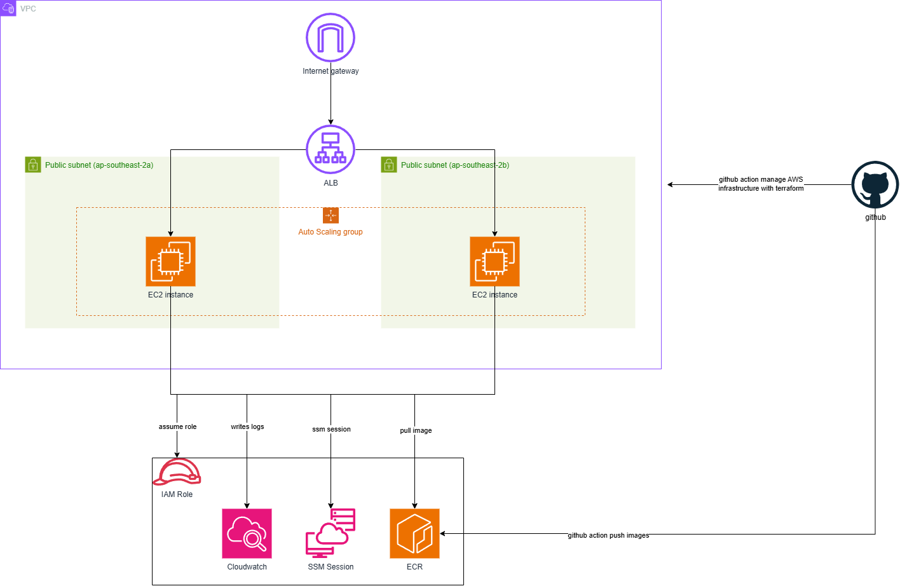

# Simple web app infrastructure

This project demonstrates simple public web app infrastructure hosted on AWS using Terraform.
The web app is a default NGINX page hosted on ASG w/ 2 EC2 instances to ensure high availability.
The deployment is achieved via Github action.

## Planned architecture



- Region: `ap-southeast-2` (Sydney).
- Application Load Balancer distributes traffic across healthy instances.
- Auto Scaling Group maintains at least two EC2 instances across two AZs.
- Terminated or unhealthy instances are replaced automatically using EC2 and load balancer health checks.
- Cloud-init to pull NGINX image from ECR. (The ECR image is the default NGINX image)
- Terraform manages all infrastructure; deployment via Github. Auth to AWS via OIDC.
- Use S3 for Terraform backend state.

## Planned code layout

- `infra/`: Terraform root configuration, variables, outputs, and example inputs.
- `infra/tf-state/`: S3 state bucket module.
- `infra/network/`: VPC, subnets, routing, and security groups.
- `infra/web-app/`: load balancer, launch template, and Auto Scaling Group.
- Apply `project` tag `simple-web-app-infra`

## Assumptions

- Indicative monthly estimate is higher than AUD 20, estimated at AUD 45 (USD 30).
- Traffic is minimal, almost zero traffic. Use the smallest EC2 instance `t4g.nano`.
- This project is to demonstrate the HA infra to host web app, with below limitation:
  - HTTPS and custom DNS are outside this project scope.
  - The web app is static web app, no database layer.
  - Everything in the public subnet for cost saving (avoid using NAT gateway).
  - Cloudwatch logs for debug purpose only.
  - Although serverless infrastructure can be used, this project is to demonstrate web app hosted on EC2 instances.

## Migrate tf state to s3

```sh
# Comment the backend.tf file content completely when first time to bring up the infra
terrform init
terrform apply

# Note down the S3 bucket name after first terraform apply or run below
terraform output

# Migrate tf state to S3 bucket
terraform init -migrate-state \
  -backend-config="bucket=${bucket_name}"
```
